# Тут пайплайн виконання

## Step 0

На цьому кроці користувач просто обирає, який шаблон він хоче створити, наприклад `lab1-template.py` або `lab2-template.py`. Залежно від вибору користувача, має з'явитися набір полів для заповнення. Існує лише дві секції полів, які користувач може заповнювати незалежно від вибору шаблону:

1) Спеціальні параметри
2) Універсальні параметри

### Спеціальні параметри

Спеціальні параметри — це набір полів, специфічних для кожного шаблону. Наприклад, у `lab1-template.py` ми маємо наступний код:


```python

import os
import docx
from docx.shared import Pt
from docx.shared import Cm as DocxCm  # Унікальна назва для відступів у Word
from docx.enum.text import WD_ALIGN_PARAGRAPH

from reportlab.lib.pagesizes import A4
from reportlab.platypus import SimpleDocTemplate, Paragraph, Spacer
from reportlab.lib.styles import getSampleStyleSheet, ParagraphStyle
from reportlab.pdfbase import pdfmetrics
from reportlab.pdfbase.ttfonts import TTFont
from reportlab.lib.enums import TA_CENTER, TA_JUSTIFY
from reportlab.lib.units import cm as PdfCm  # Унікальна назва для відступів у PDF

def create_docx(filename="Lab_Template_Final.docx"):
    """Генерує DOCX файл з ідеальним форматуванням (Times New Roman, 14pt, інтервал 1.5)"""
    doc = docx.Document()
    
    # Налаштування стилю "Normal" для всього документа
    style = doc.styles['Normal']
    font = style.font
    font.name = 'Times New Roman'
    font.size = Pt(14)
    
    # Налаштування інтервалу та вирівнювання за замовчуванням
    paragraph_format = style.paragraph_format
    paragraph_format.line_spacing = 1.5
    paragraph_format.alignment = WD_ALIGN_PARAGRAPH.JUSTIFY
    paragraph_format.first_line_indent = DocxCm(1.25) # Червоний рядок
    paragraph_format.space_after = Pt(0)

    # 1. Заголовок "ЛАБОРАТОРНА РОБОТА" (по центру, звичайний)
    p_header = doc.add_paragraph()
    p_header.paragraph_format.alignment = WD_ALIGN_PARAGRAPH.CENTER
    p_header.paragraph_format.first_line_indent = DocxCm(0)
    p_header.add_run("ЛАБОРАТОРНА РОБОТА № [ВСТАВТЕ НОМЕР]")

    # 2. Назва роботи (по центру, жирний)
    p_title = doc.add_paragraph()
    p_title.paragraph_format.alignment = WD_ALIGN_PARAGRAPH.CENTER
    p_title.paragraph_format.first_line_indent = DocxCm(0)
    run_title = p_title.add_run("[Вставте назву лабораторної роботи]")
    run_title.bold = True
    
    doc.add_paragraph() # Порожній рядок

    # 3. Мета роботи (з абзацу, "Мета роботи" - жирним)
    p_meta = doc.add_paragraph()
    run_meta = p_meta.add_run("Мета роботи")
    run_meta.bold = True
    p_meta.add_run(" - [вставте текст мети роботи]")

    doc.add_paragraph()

    # 4. Загальні відомості (по центру, жирний)
    p_zagalni = doc.add_paragraph()
    p_zagalni.paragraph_format.alignment = WD_ALIGN_PARAGRAPH.CENTER
    p_zagalni.paragraph_format.first_line_indent = DocxCm(0)
    p_zagalni.add_run("Загальні відомості").bold = True

    # Текст загальних відомостей (з абзацу, по ширині)
    doc.add_paragraph("[Вставте теоретичний матеріал тут. Абзацний відступ та вирівнювання по ширині налаштовані автоматично.]")
    
    doc.add_paragraph()

    # 5. Завдання. (по центру, жирний)
    p_zavd = doc.add_paragraph()
    p_zavd.paragraph_format.alignment = WD_ALIGN_PARAGRAPH.CENTER
    p_zavd.paragraph_format.first_line_indent = DocxCm(0)
    p_zavd.add_run("Завдання.").bold = True

    # Пункти завдання (з абзацу)
    doc.add_paragraph("1. [Вставте перше завдання]")
    doc.add_paragraph("2. [Вставте друге завдання]")

    doc.add_paragraph()

    # 6. Контрольні запитання (по центру, жирний)
    p_kontr = doc.add_paragraph()
    p_kontr.paragraph_format.alignment = WD_ALIGN_PARAGRAPH.CENTER
    p_kontr.paragraph_format.first_line_indent = DocxCm(0)
    p_kontr.add_run("Контрольні запитання").bold = True

    doc.add_paragraph("1. [Вставте перше запитання]")
    doc.add_paragraph("2. [Вставте друге запитання]")

    doc.add_paragraph()

    # 7. Література (по центру, жирний)
    p_lit = doc.add_paragraph()
    p_lit.paragraph_format.alignment = WD_ALIGN_PARAGRAPH.CENTER
    p_lit.paragraph_format.first_line_indent = DocxCm(0)
    p_lit.add_run("Література").bold = True

    doc.add_paragraph("1. [Вставте перше джерело]")
    doc.add_paragraph("2. [Вставте друге джерело]")

    doc.save(filename)
    print(f"Успішно створено файл: {filename}")


def create_pdf(filename="Lab_Template_Final.pdf"):
    """Генерує PDF з точним дотриманням відступів та шрифтів"""
    
    # Реєстрація шрифтів Times New Roman (стандартні шляхи для Windows)
    try:
        pdfmetrics.registerFont(TTFont('TimesNewRoman', 'times.ttf'))
        pdfmetrics.registerFont(TTFont('TimesNewRoman-Bold', 'timesbd.ttf'))
        font_regular = 'TimesNewRoman'
        font_bold = 'TimesNewRoman-Bold'
    except Exception as e:
        print("Попередження: Шрифти Times New Roman не знайдено в системі. Використовується шрифт за замовчуванням.")
        font_regular = 'Helvetica'
        font_bold = 'Helvetica-Bold'

    # Використовуємо PdfCm для безпечного встановлення полів
    doc = SimpleDocTemplate(filename, pagesize=A4,
                            rightMargin=1.5*PdfCm, leftMargin=3.0*PdfCm,
                            topMargin=2.0*PdfCm, bottomMargin=2.0*PdfCm)
    
    # Налаштування стилів (14pt, 1.5 інтервал (leading ~21))
    style_center = ParagraphStyle(
        name='CenterNormal', fontName=font_regular, fontSize=14, leading=21, 
        alignment=TA_CENTER, spaceAfter=14)
    
    style_center_bold = ParagraphStyle(
        name='CenterBold', fontName=font_bold, fontSize=14, leading=21, 
        alignment=TA_CENTER, spaceAfter=14, spaceBefore=14)
    
    style_body = ParagraphStyle(
        name='BodyJustify', fontName=font_regular, fontSize=14, leading=21, 
        alignment=TA_JUSTIFY, firstLineIndent=35, spaceAfter=10) # 35 point ~ 1.25 cm

    story = []

    # 1. Заголовок
    story.append(Paragraph("ЛАБОРАТОРНА РОБОТА № [ВСТАВТЕ НОМЕР]", style_center))
    # 2. Назва
    story.append(Paragraph("[Вставте назву лабораторної роботи]", style_center_bold))
    
    # 3. Мета
    story.append(Paragraph("<b>Мета роботи</b> - [вставте текст мети роботи]", style_body))
    
    # 4. Загальні відомості
    story.append(Paragraph("Загальні відомості", style_center_bold))
    story.append(Paragraph("[Вставте теоретичний матеріал тут. Абзацний відступ та вирівнювання по ширині налаштовані автоматично.]", style_body))
    
    # 5. Завдання
    story.append(Paragraph("Завдання.", style_center_bold))
    story.append(Paragraph("1. [Вставте перше завдання]", style_body))
    story.append(Paragraph("2. [Вставте друге завдання]", style_body))
    
    # 6. Контрольні запитання
    story.append(Paragraph("Контрольні запитання", style_center_bold))
    story.append(Paragraph("1. [Вставте перше запитання]", style_body))
    story.append(Paragraph("2. [Вставте друге запитання]", style_body))

    # 7. Література
    story.append(Paragraph("Література", style_center_bold))
    story.append(Paragraph("1. [Вставте перше джерело]", style_body))
    story.append(Paragraph("2. [Вставте друге джерело]", style_body))

    doc.build(story)
    print(f"Успішно створено файл: {filename}")

if __name__ == "__main__":
    create_docx("Lab_Template_Final.docx")
    create_pdf("Lab_Template_Final.pdf")


```


Де ми маємо наступні секції:

- заголовок
- назва
- мета
- загальні відомості 
- завдання
- контрольні питання
- література


Отже, ми маємо можливість заповнювати поля ось так:

 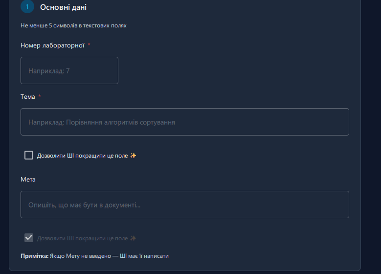

Але якщо шаблон інший, тому набір інструкцій є динамічним, особливо для кожного шаблону, він може змінюватися від шаблону до шаблону. Для кожного поля зі списку буде опція на кшталт:

**GIVE ACCESS TO AI** — якщо `true`, то AI може змінювати вміст цього додатка; якщо `false`, то AI не може цього робити.


### Універсальні параметри

Універсальні параметри — це набір параметрів, який є статичним для кожного шаблону, і виглядає так:

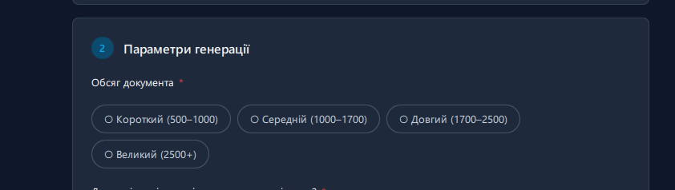

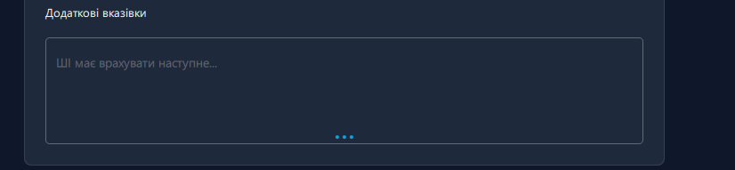

Ці параметри завжди доступні користувачеві, незалежно від вибору шаблону. Ось детальніше про них:

- **Користувацькі преференції** (текст, який має використовуватися під час генерації контенту моделлю; це має бути статичною опцією для кожного шаблону, який обирає користувач; усі інші поля можуть відрізнятися залежно від скрипта шаблону).
  
  Користувач також може керувати деякими параметрами, які мають бути статичними для всіх шаблонів. Ось ці параметри:
  
  - **Обсяг тексту** (короткий, середній, довгий, великий), кожен стан містить діапазон кількості слів: короткий — 500–1000, середній — 1000–1700, довгий — 1700–2500, великий — 2500+. Також можна точніше задати діапазон кількості слів.
  - **Чи містить робота зображення чи схеми** (якщо увімкнено, текстова LLM може створити посилання на зображення в контенті, якщо це необхідно, а потім модель зображень створить зображення відповідно до цих посилань і вставить їх у фінальний PDF і DOCX). У якому форматі мають бути ці посилання і як моделі мають розуміти одна одну, має бути описано всередині глобальних інструкцій.
  - **Режими складності** (hardness) — параметр, який контролює складність тексту (наприклад: для школярів, випускників, 1 курс університету, 2 курс університету і так далі, аж до бакалавра).
  - **Прикріплені файли користувача** — якщо користувач прикріплює файл, він також має бути статичним параметром: 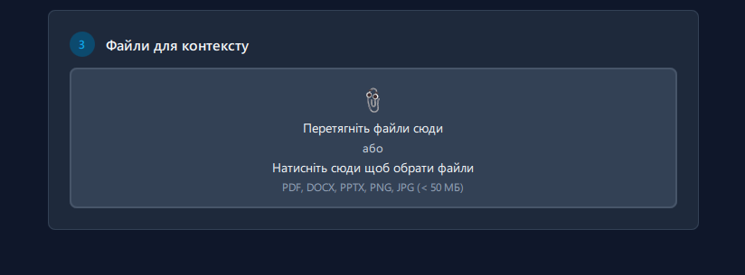
  - **Чекбокс для увімкнення спеціальних інструкцій** (це md-файл, який детально описує кожен шаблон для AI; він зберігається в `app/instructions/template-ins/`. Якщо користувач увімкне його, інструкції додаються до контексту на наступному кроці).
  - **Загальні інструкції** (стандартні інструкції, які завжди додаються до контексту на наступному кроці).
  - **Опція додати файл стилю користувача** як контекст до наступного кроку (це набір інструкцій, що містить інформацію про вихідні дані з урахуванням преференцій користувача: стиль, як писати та інші опції, які користувач хоче бачити).

А також сам промпт користувача, який має бути основним промптом для моделі і має створювати основну частину контенту в майбутньому документі. Згідно з цим промптом і параметрами вище має створюватися контент для заповнення Python-скрипта (*але якщо користувач вимкне AI ACCESS до поточного поля, AI має просто зберегти контент і не змінювати його*).


### JSON-запит


JSON із цього вводу користувача має бути розділений на дві частини, або на два файли. В одному файлі/частині буде динамічна інформація, яка визначається вибором шаблону, — там буде весь контент, який використовується для заповнення полів цього шаблону. У другому файлі має бути вся статична інформація з основним промптом, набором параметрів та інформацією про прикріплені файли.


## Step 1 (debug/transit)


Перший крок — це крок після того, як користувач ввів інформацію, заповнив усі поля, прикріпив усі файли, налаштував `user_style.md` в GUI та інше, і саме в момент, коли користувач натискає «Створити».

Перед будь-якими діями в `app/debug/transit` мають бути поміщені наступні файли та JSON-и:

1) Усе з кроку 0, JSON-и та файли, які згадані в кроці 0.
2) Усі файли, які були додані як контекст у форматах pdf, docx, pptx, image, мають бути конвертовані в txt і поміщені в папку transit (один файл — один txt), використовуючи наявні скрипти:

- [docx](../../docx2txt.py)

- [image](../../image2txt.py)

- [pdf](../../pdf2txt.py)

- [pptx](../../pptx2txt.py)


## Step 2 (debug/compact/) — після стиснення


Цей крок має відображати файли з кроку 1, але деякі з цих файлів пройшли через компактну модель Qwen. Для більш детального пояснення цієї частини кроку перегляньте `backend work.md` та `BACKEND_PLAN.md` — там можна знайти деталі, як це має бути, але звертайте увагу лише на цю частину, без читання інших деталей цих файлів, оскільки вони більше не стосуються нас.

    Іншими словами, локальна модель має взяти всі txt-файли з прикріплених файлів і спеціальні інструкції, якщо їх було додано, стиснути їх, зберігаючи основну інформацію, але зменшуючи кількість токенів цих файлів. Після цього кожен стиснутий файл має бути збережений в `app/data/cache` як кешований txt-файл і поміщений у базу даних, і якщо користувач прикріпить той самий файл знову, його не потрібно буде стискати знову — просто взяти існуючий з кешу. Також має бути налаштований період видалення цих кешів у налаштуваннях застосунку (і в змінних середовища). Те саме зі спеціальними інструкціями, але без періоду видалення.

**Про env.** Також має бути змінна, яка контролює історію сесій і видаляє старі сесії після певного періоду часу. Це має контролюватися у файлі `.env`.

Файли, як-от глобальні інструкції, user style і статичний контент, крім прикріплених файлів, мають зберігатися як є.

**Важливо** — модель має бути активною лише під час компактування, потім вона має бути неактивною. Також вона має бути попередньо встановлена разом із застосунком. 

## step 3 (debug/main_out/ ) — після основної LLM моделі

Цей крок має відображати стан файлів одразу після основної моделі. Він має показувати скрипт `filled.py`, JSON з інформацією про сесію та всі ці файли, але вже без контексту з прикріплених файлів і без спеціальних для шаблону інструкцій.

Також має бути створений `manifest.json`, куди поміщатимуться інструкції зі створення діаграм (у випадку, якщо генерацію зображень увімкнено).

**Важливо** — глобальні інструкції все ще мають бути тут як частина контексту для моделі-генератора зображень.


## step 4 (debug/image-gen ) — після моделі-генератора зображень (опційно)

Якщо користувач увімкнув зображення в роботі, то тут замість `manifest.json` і решти файлів з попереднього кроку мають вже бути створені зображення.


## step 5 (debug/output ) — фінальний

На цьому кроці ми маємо мати повністю сконфігурований docx-файл, pdf-файл, останню версію заповненого python-скрипта, зображення з попереднього кроку. А також повністю заповнений `index.json` з усією інформацією про сесію: час початку, час завершення, час компактування, назву та інше.

---

## Схема пайплайну (Mermaid)

### Загальний потік (5 етапів)

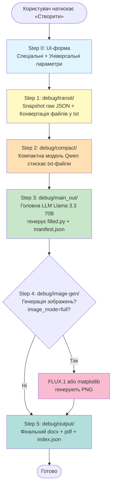

### Step 0 — UI-форма (деталізація)

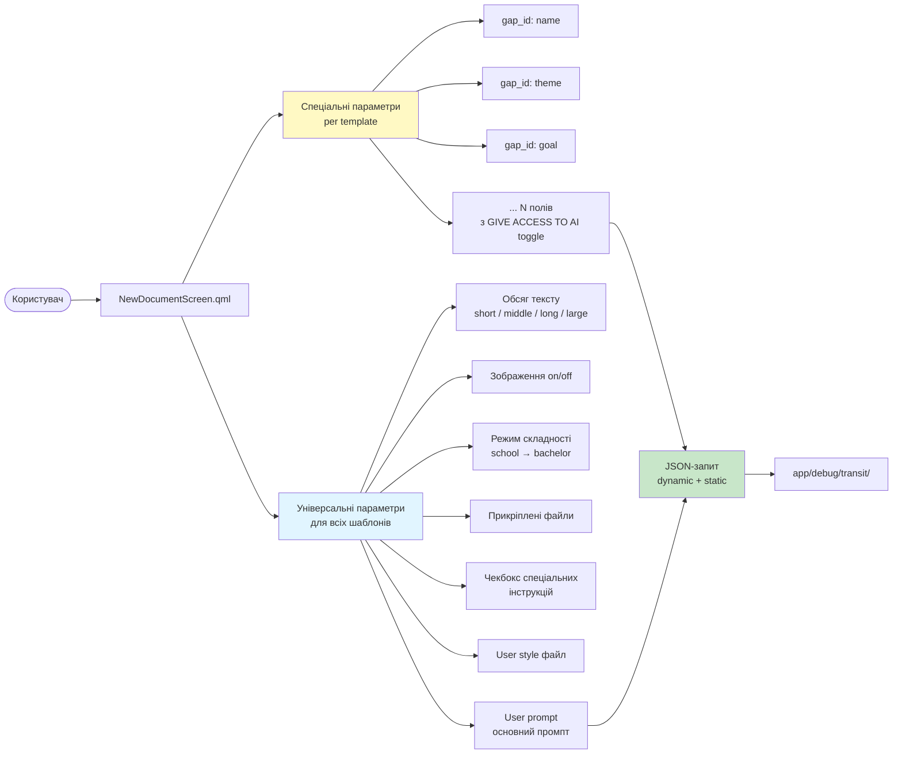

### Step 1 — Transit (деталізація)

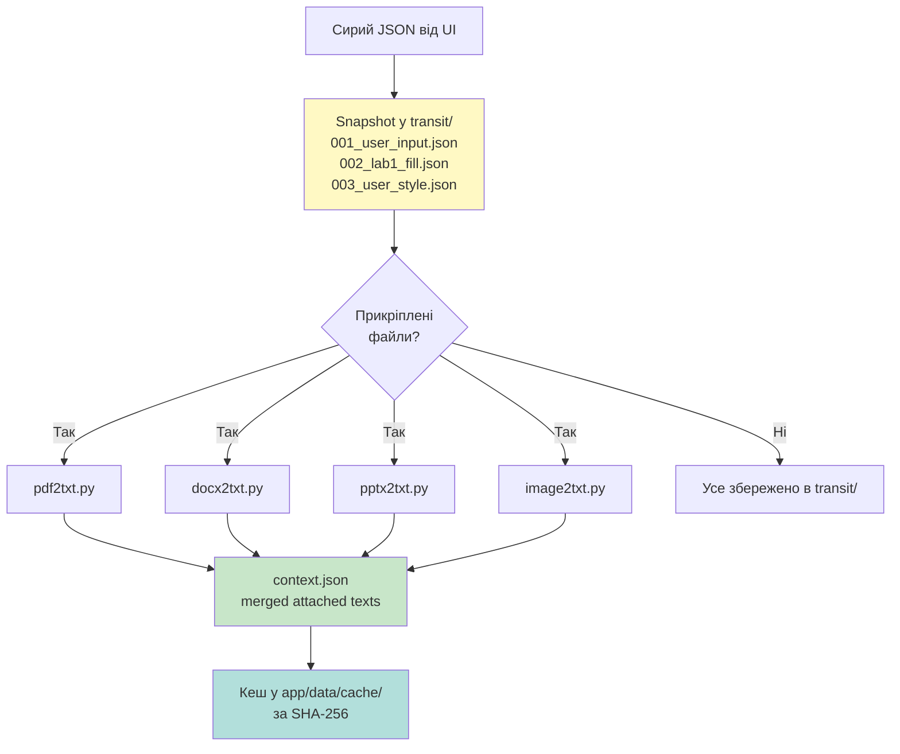

### Step 2 — Compact (деталізація)

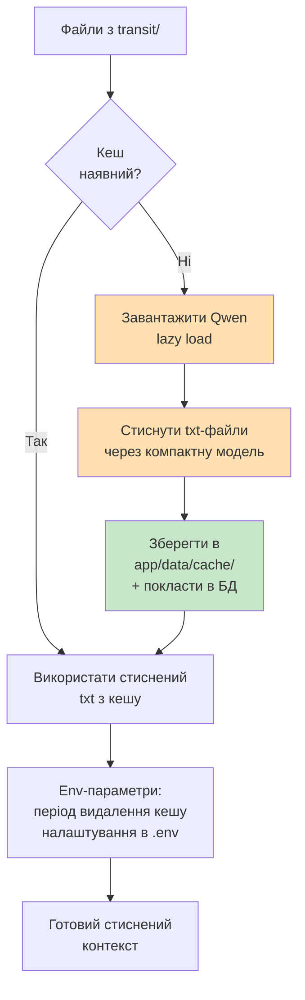

### Step 3 — Main LLM (деталізація)

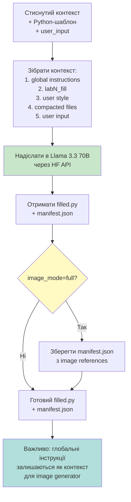

### Step 4 — Image Generation (деталізація)

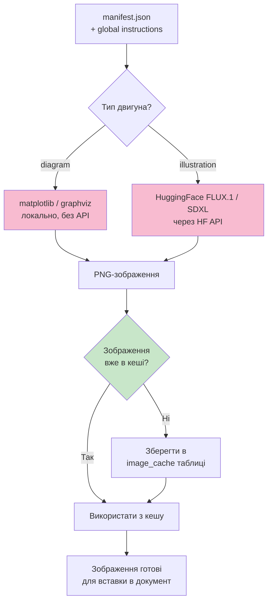

### Step 5 — Output (деталізація)

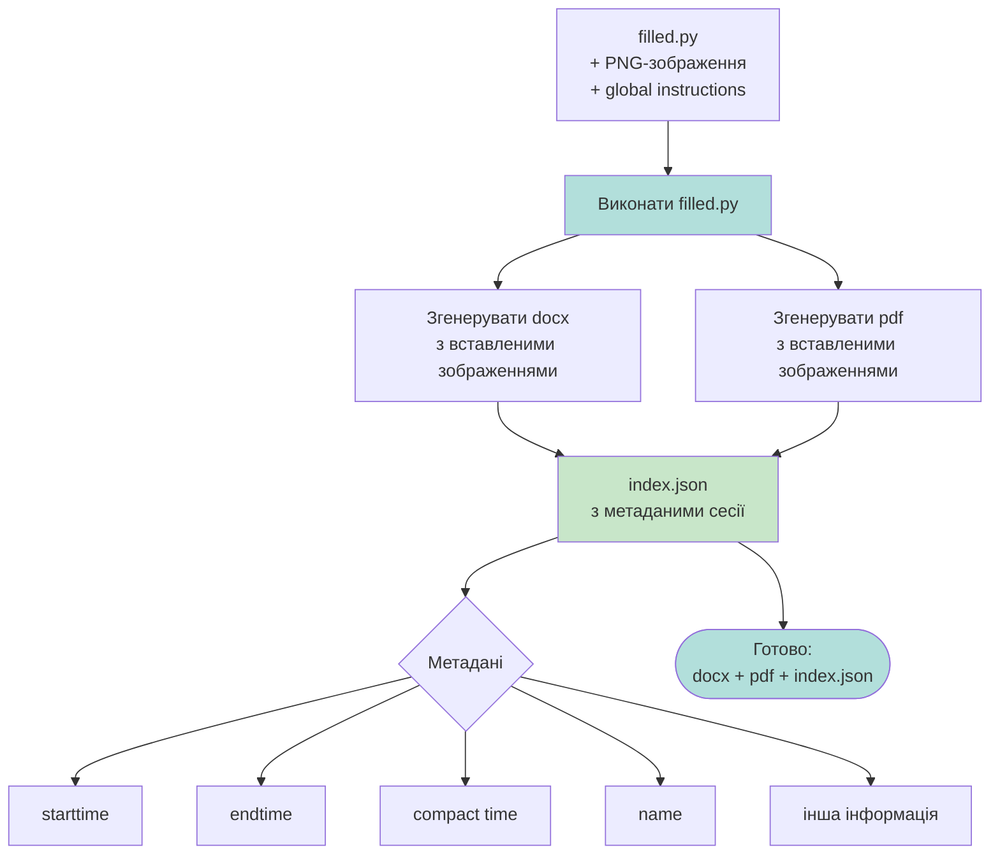

### Debug-папки (структура)

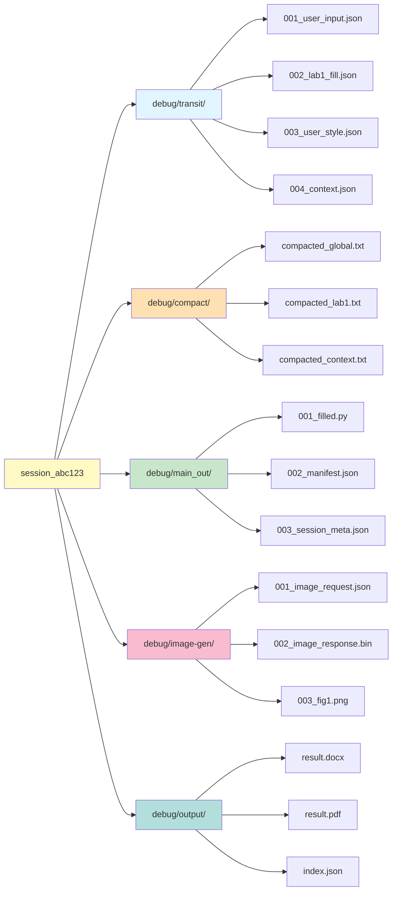
