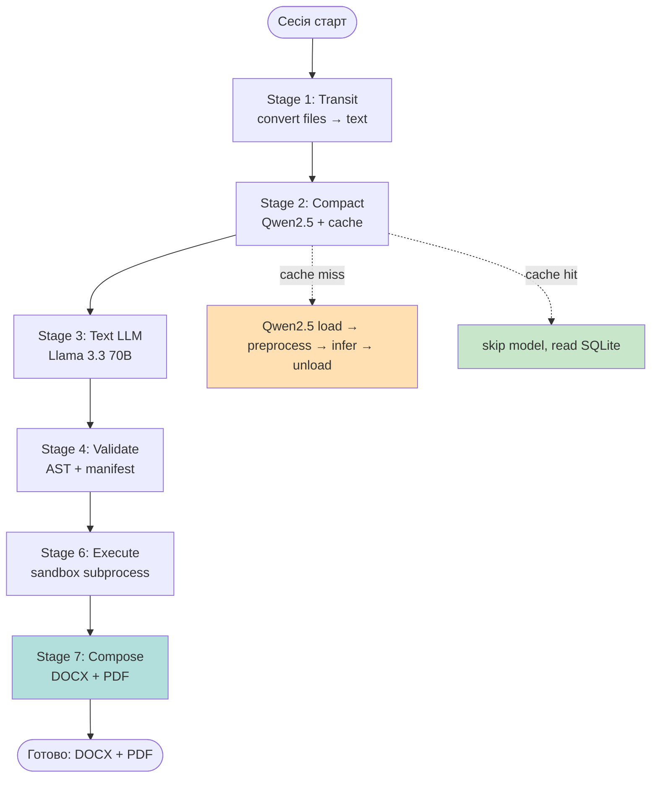
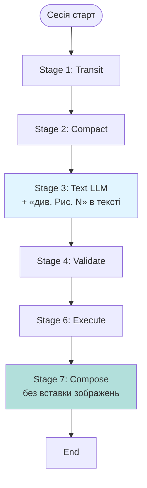

# План пайплайну виконання Agent-For-Labs (v3)

> **Джерело головної ідеї:** `None ai/working/backend3/Pipeline of execution/Pipeline.md` (Step 0–5, debug-папки `transit/compact/main_out/image-gen/output`, поділ Special/Universal параметрів, GIVE ACCESS TO AI per gap).
>
> **Джерело технічної підтримки:** `None ai/working/backend/BACKEND_PLAN.md` (Qwen2.5-1.5B компактор, 6 підкроків Preprocess, SandboxRunner з setrlimit, Fallback chain, debug-папки `transit/press/output`, Production switch DEBUG_MODE).
>
> **Цей документ — авторитетна специфікація pipeline.** `docs/apps_loogic.md` залишається архітектурним референсом; `BACKEND_PLAN.md` — implementation-detail джерело для бекенду.

---

## 0. Виправлення ідей з оригінального `Pipeline.md`

Оригінальний документ мав правильну верхньорівневу форму, але 12+ концептуальних прогалин. Нижче — таблиця «було → стало»:

| # | Ідея в `Pipeline.md` | Проблема | Рішення в цьому плані |
|---|---|---|---|
| 1 | «Step 0» — це і UI-форма, і крок пайплайну | Змішування двох фаз | Step 0 = **UI-форма** (вибір template, заповнення gaps). Крок 1+ = **власне pipeline** |
| 2 | Кроків 6 (0–5), у `apps_loogic.md` — 6 (Step 0–5) | Збігаються, але називаються інакше | **Уніфікована нумерація**: UI-форма → Stage 1 (Transit) → Stage 2 (Compact) → Stage 3 (Text LLM) → Stage 4 (Validate) → Stage 5 (Images) → Stage 6 (Execute) → Stage 7 (Compose) |
| 3 | Validate відсутній як окремий крок | Validate вшитий у «step 3» | Виокремлюємо в **Stage 4 (Validate)** з власним `error_stage='validate'` і кешем |
| 4 | Compact модель = «local model qwen» без технічних деталей | Архітектурно невизначено | `Qwen2.5-1.5B-Instruct Q4_K_M` через `llama-cpp-python`, lazy load/unload, **3 рівні кешу** (compacted_static + compacted_session_context + bypass для user_input/user_style) |
| 5 | Image ref формат не визначено | Промпт LLM не знає, як генерувати anchors | Формат `[[ANCHOR:figN:rand]]` (узгоджено з `global_instructions.md` § 6) |
| 6 | Manifest тільки при «images enabled» | Не уточнено: `none` / `references` / `full` | Три режими явно: `none` (без manifest), `references` (текст «(див. Рис. N)» без `[[ANCHOR]]`), `full` (manifest + anchors + PNG generation) |
| 7 | Спеціальні інструкції як чекбокс | `global` і `special` інструкції **завжди** в контексті, не вимикаються | **Залишаємо «чекбокс» як override-рівень** (user-created інструкція може замінити special), але базові special/global — **завжди** |
| 8 | Sandbox = `python filled.py` без обмежень | Небезпечно (HF_TOKEN у env, fork bombs, 50 MB+ output) | `SandboxRunner`: `subprocess.run` + `tempfile.TemporaryDirectory` + `env={SYSTEMROOT, TEMP}` + `setrlimit(RLIMIT_CPU=60, RLIMIT_FSIZE=50MB, RLIMIT_NPROC=1)` (POSIX) / `win32job` (Windows) |
| 9 | Debug-папки: `transit/compact/main_out/image-gen/output` (5 папок) | Забагато; `main_out` дублює `transit` | **3 папки** замість 5: `transit/` (raw JSON), `press/` (compactor I/O + bypass raw), `output/` (main LLM + images + final files) |
| 10 | Cache для компактованих файлів у `app/data/cache` як txt | Немає дедуплікації за хешем; тільки за іменем | **SQLite** таблиці `compacted_static` (sha256(global \|\| labN_fill)) + `compacted_session_context` (sha256(merge(attached_texts))). Дедуплікація за **SHA-256** |
| 11 | Global inst, user style зберігаються «як є» | Не сказано, що вони **обходяться** компактор | Чітко: compactor scope = **3 рівні** (static + session_context + skip user_input/user_style) |
| 12 | «compact model qwen ... must be preinstalled with whole app. Also it must be active only during the compacting, then it must be not active» | «preinstalled» — це deployment hint, не спека | Bundled GGUF (1.0 GB) у `app/backend/models/compactor/`, **lazy load + unload per use** через `LocalLLMCompressor.__enter__/__exit__` |
| 13 | «GIVE ACCESS TO AI» per gap | Унікальна ідея, відсутня в `docs/` | Зберігаємо як `gap_schema[*].ai_accessible: bool` у `templates` таблиці; передаємо в `input_snapshot` сесії; LLM промпт додає «НЕ ЧІПАЙ: gap_id=X, content=...» для gap-ів з `ai_accessible=false` |
| 14 | Json request split на 2 файли (dynamic + static) | Це серіалізація, а не логіка | Один `input_snapshot` JSON у `sessions` таблиці, з полями `gap_values` (dynamic) і root fields (static: length, hardness, image_mode, theme, goal, files) |
| 15 | Error stages відсутні | Pipeline може впасти на 100 місцях, немає класифікації | 6 `error_stage` значень: `file_convert` / `text_model` / `validate` / `image_gen` / `execute` / `compose` (узгоджено з `docs/apps_loogic.md` § Матриця помилок) |
| 16 | Cancel pipeline | Відсутній | `PipelineOrchestrator.cancel()` → `QThread.requestInterruption()` + cleanup subprocess + rollback DB до `status='cancelled'` |

---

## 1. Загальний огляд

### 1.1. Потік (high-level)

```
┌────────────────────────────────────────────────────────────┐
│ UI-FORM (Step 0)                                           │
│  - template_id (lab1/lab2/...)                             │
│  - gap_values (special parameters)                         │
│  - length, hardness, image_mode (universal parameters)     │
│  - attached files                                          │
│  - user_style.md (per-user)                                │
│  - "GIVE ACCESS TO AI" toggles per gap                    │
└──────────────────┬─────────────────────────────────────────┘
                   │ POST /startGeneration
                   ▼
┌────────────────────────────────────────────────────────────┐
│ STAGE 1 — TRANSIT (debug/transit/)                         │
│  - Save raw JSON inputs до будь-якої обробки               │
│  - Convert attached files (pdf/docx/pptx/image) → text     │
│  - Hash each file (SHA-256) → library_file dedup            │
│  - Per-file summary якщо > 4000 tokens                     │
└──────────────────┬─────────────────────────────────────────┘
                   │
                   ▼
┌────────────────────────────────────────────────────────────┐
│ STAGE 2 — COMPACT (debug/press/)                           │
│  Compact model: Qwen2.5-1.5B-Instruct Q4_K_M (lazy load)   │
│  - Compact static: global_instructions + labN_fill         │
│  - Compact session_context: merged attached texts          │
│  - SKIP: user_input, user_style (pass through)             │
│  - Fallback chain: cache → LLM → extractive (sumy) → orig  │
│  - 6 підкроків Preprocess (hash, lang, tokens, markers,    │
│    normalize, payload)                                     │
│  - Validation: structural (S1) + markers (S2)              │
└──────────────────┬─────────────────────────────────────────┘
                   │
                   ▼
┌────────────────────────────────────────────────────────────┐
│ STAGE 3 — TEXT LLM (debug/output/)                         │
│  Main model: Llama-3.3-70B-Instruct (HF Inference API)     │
│  Context (in priority order):                              │
│    1. global_instructions (compact or original)            │
│    2. labN_fill (compact or original)                      │
│    3. user_style (тільки якщо !is_empty)                   │
│    4. compacted_session_context (per session)              │
│    5. user_input (gap values + theme + goal)               │
│    6. Python template                                      │
│  Output: filled.py (text)                                  │
│  - Якщо image_mode=full: + image_manifest.json             │
│  - Якщо image_mode=references: + текст "див. Рис. N"       │
│  - Gaps з ai_accessible=false → НЕ змінюються              │
└──────────────────┬─────────────────────────────────────────┘
                   │
                   ▼
┌────────────────────────────────────────────────────────────┐
│ STAGE 4 — VALIDATE                                         │
│  - ast.parse(filled.py) → HARD FAIL                        │
│  - Unfilled [Вставте ...] placeholders → HARD FAIL         │
│  - Word count в межах ±15% від target → WARN               │
│  - ManifestValidator: [[ANCHOR:figN:rand]] синхронні в     │
│    DOCX і PDF версіях → WARN                               │
│  - Малформований manifest → WARN + strip                   │
│  - 3-рівневий cache check перед LLM:                        │
│      llm_cache (key=hash(template+params+files+style))      │
│      → HIT = skip Stage 3                                  │
└──────────────────┬─────────────────────────────────────────┘
                   │
        ┌──────────┴──────────┐
        ▼                     ▼
┌────────────────┐   ┌────────────────────────┐
│ image_mode=    │   │ image_mode=full:       │
│ none/references│   │ STAGE 5 — IMAGES        │
│ → STAGE 6      │   │ 5a: Parse manifest     │
└────────────────┘   │ 5b: Generate diagrams   │
                     │     (matplotlib local)  │
                     │ 5c: Generate illustr.   │
                     │     (FLUX.1 HF API)     │
                     │ 5d: Image cache check   │
                     │     (per render_spec)   │
                     │ 5e: _FAILED for errors  │
                     └────────┬───────────────┘
                              │
                              ▼
                   ┌────────────────────────┐
                   │ STAGE 6 — EXECUTE       │
                   │ SandboxRunner:          │
                   │  subprocess + tempfile  │
                   │  + setrlimit (POSIX)    │
                   │  + win32job (Windows)   │
                   │  + env={SYSTEMROOT,TEMP}│
                   │  filled.py → DOCX + PDF │
                   │  + raw PNG files        │
                   └────────┬───────────────┘
                              │
                              ▼
                   ┌────────────────────────┐
                   │ STAGE 7 — COMPOSE       │
                   │ - Insert PNG at anchors │
                   │   in DOCX and PDF       │
                   │ - Add "Рис. N — caption"│
                   │ - Strip [[ANCHOR:...]]  │
                   │ - Save session_metadata │
                   │ - Purge old debug       │
                   │   sessions (keep=50)    │
                   └────────┬───────────────┘
                              │
                              ▼
                   ┌────────────────────────┐
                   │ Output:                 │
                   │ - result.docx           │
                   │ - result.pdf            │
                   │ - result.png (figs)     │
                   │ - filled.py (archived)  │
                   │ - session.json metadata │
                   └────────────────────────┘
```

### 1.2. 3 діаграми для `image_mode`

(Адаптовано з `BACKEND_PLAN.md` § 2)

#### Діаграма A: `image_mode = none`



#### Діаграма B: `image_mode = references`



#### Діаграма C: `image_mode = full`

```mermaid
flowchart TD
    Start([Сесія старт]) --> S1[Stage 1: Transit]
    S1 --> S2[Stage 2: Compact]
    S2 --> S3[Stage 3: Text LLM<br/>+ [[ANCHOR:figN:rand]] + manifest]
    S3 --> S4[Stage 4: Validate<br/>filled.py + manifest]
    S4 --> S5a[Stage 5a: Parse manifest]
    S5a --> S5b[Stage 5b: Generate diagrams<br/>matplotlib / graphviz]
    S5a --> S5c[Stage 5c: Generate illustrations<br/>FLUX.1 / SDXL]
    S5b --> S6[Stage 6: Execute]
    S5c --> S6
    S6 --> S7[Stage 7: Compose<br/>insert PNGs + strip markers]
    S7 --> End

    style S5b fill:#fff9c4
    style S5c fill:#f8bbd0
    style S6 fill:#c8e6c9
    style S7 fill:#b2dfdb
```

---

## 2. Деталі по стадіях

### Stage 0 — UI-форма (НЕ частина pipeline, але генерує input_snapshot)

**Файл:** `app/ui/NewDocumentScreen.qml`

**Поля форми (розділені на 2 групи відповідно до `Pipeline.md`):**

#### Special parameters (per template)
- `template_id` (вибір з `templates` таблиці, наприклад `lab1` / `lab2`)
- `gap_values` — масив `[{gap_id, value, ai_accessible}]`
  - `gap_id` з `templates.gap_schema[*].gap_id`
  - `value` — текст або markdown
  - `ai_accessible` — boolean, **GIVE ACCESS TO AI**
    - `true` → LLM може змінити/розширити цей gap
    - `false` → LLM має ЗАЛИШИТИ gap як є (тільки мовна корекція)

#### Universal parameters (статичні для всіх шаблонів)
- `name` (назва сесії) — автогенерована, юзер може редагувати
- `theme` (тема лабораторної)
- `goal` (мета роботи)
- `length` ∈ {`short` (500–1000 слів), `middle` (1000–1700), `long` (1700–2500), `large` (2500+)}
- `hardness` ∈ {`school`, `university_1`, `university_2`, `bachelor`}
- `image_mode` ∈ {`none`, `references`, `full`}
- `attached_files[]` (PDF/DOCX/PPTX/PNG/JPG, ≤50 MB кожен)
- `include_special_instructions` (boolean) — default `true`; якщо `false` → LLM отримує тільки `global`
- `include_user_style` (boolean) — default `true`; якщо `false` → `user_style` не додається
- `user_input` — основний промпт користувача (theme + goal + побажання)

**На виході Stage 0:**
```json
{
  "session_name": "Лаба 1 — сортування",
  "template_id": "lab1",
  "input_snapshot": {
    "gap_values": {
      "footer": {"value": "Студент: Іван Петренко", "ai_accessible": false},
      "lab_number": {"value": "1", "ai_accessible": true}
    },
    "theme": "Алгоритми сортування",
    "goal": "Порівняти bubble sort і quicksort",
    "length": "long",
    "hardness": "university_1",
    "image_mode": "full",
    "user_input": "Зроби акцент на bubble sort, додай UML діаграму",
    "include_special_instructions": true,
    "include_user_style": true,
    "attached_files": ["file_hash_1", "file_hash_2"]
  }
}
```

---

### Stage 1 — Transit (`debug/transit/`)

**Призначення:** зберегти raw вхідні дані від UI **до** будь-якої обробки бекендом, конвертувати прикріплені файли в текст.

**Файли в `transit/`:**
```
debug/transit/session_<sid>/
├── 001_general_instructions.json      # raw from UI (active version from instructions table)
├── 002_labN_fill.json                  # raw from UI (per template, if include_special_instructions)
├── 003_user_style.json                 # raw from UI (if include_user_style && !is_empty)
├── 004_user_input.json                 # raw from UI (input_snapshot)
└── 005_context.json                    # merged converted text of attached files (after Stage 1 done)
```

**Кроки:**
1. **Snapshot raw inputs** → `transit/` (вище).
2. **Convert attached files** → text (using existing `app/backend/docx2txt.py`, `pdf2txt.py`, `pptx2txt.py`, `image2txt.py`).
3. **Hash each file** (SHA-256) → check `library_file` table:
   - **HIT:** reuse existing `converted_text` and `conversion_status`.
   - **MISS:** convert, save to `library_file` with `conversion_status='done'`.
4. **Per-file summarization** якщо `converted_text` > 4000 tokens:
   - Use existing `context_summarizer.py` (per-file 4000→500).
   - Write to `session_files.was_summarized=1`, `token_count_used=500`.
5. **Merge attached texts** → `context.json` у `transit/`.
6. **Write `context.json`** to `transit/`.

**Error stage:** `file_convert`
**Error matrix:**
| Помилка | Серйозність | Дія |
|---|---|---|
| Невідомий тип файлу | WARN | Пропустити, продовжити |
| Конвертація порожня | WARN | Пропустити, продовжити |
| Файл >50 MB | WARN | Пропустити, повідомити |
| Permission denied | WARN | Пропустити |

---

### Stage 2 — Compact (`debug/press/`)

**Призначення:** стиснути статичні інструкції та контекст сесії за допомогою локальної Qwen2.5-1.5B, щоб зменшити токени для Text LLM.

**Compactor scope (3 рівні):**

| Рівень | Що стискається | Cache key | TTL |
|---|---|---|---|
| Static | `global_instructions.md` + `labN_fill.md` | `sha256(global_text \|\| labN_text)` | безстроково (версіонування через `instructions.content_hash`) |
| Session context | `merge(attached_texts)` | `sha256(merge(attached_texts))` | 30 днів (configurable) |
| Bypass | `user_input`, `user_style` | — | — |

**Файли в `press/`:**
```
debug/press/session_<sid>/
├── 001_qwen2.5_request_global.txt      # prompt → Qwen2.5 (Stage 2a)
├── 002_qwen2.5_response_global.txt     # raw response
├── 003_compacted_global.txt            # post-processed + validated
├── 004_qwen2.5_request_labN.txt        # prompt → Qwen2.5 (Stage 2b)
├── 005_qwen2.5_response_labN.txt
├── 006_compacted_labN.txt
├── 007_qwen2.5_request_context.txt     # prompt → Qwen2.5 (Stage 2c, session context)
├── 008_qwen2.5_response_context.txt
├── 009_compacted_context.txt
├── 010_cache_lookup_log.json           # cache hit/miss per file
├── 011_user_input_raw.json             # bypassed raw (not compressed)
└── 012_user_style_raw.json             # bypassed raw (not compressed)
```

**Крок 0 — Preprocess (6 підкроків, деталі з `BACKEND_PLAN.md`):**

| # | Підкрок | Метод | Час | Результат |
|---|---|---|---|---|
| 0.1 | `content_hash` | `hashlib.sha256(text.encode()).hexdigest()` | <1 ms | str (64 chars) |
| 0.2 | `language` | `langdetect.detect(text)` або count('і','є','ї')/len | ~5 ms | `uk` / `en` / `mixed` |
| 0.3 | `token_count` | `transformers.AutoTokenizer` (Qwen2.5) | ~50 ms / 100 KB | int |
| 0.4 | `markers` | regex `\[\[ANCHOR:[^\]]+\]\]` + `<!--IMAGE_MANIFEST-->` | <5 ms | list[str] |
| 0.5 | `normalized` | `\n{3,}` → `\n\n`, trim, single space | <10 ms | str |
| 0.6 | `payload` | dict merge | <1 ms | dict |

**Chunk-mode** (>n_ctx): chunk по абзацах, prompt додає «Це частина N з M».
**Mixed language:** prompt додає «Збережи обидві мови як є».
**Marker preservation:** prompt додає «ЗБЕРЕЖИ всі маркери [[ANCHOR:...]] дослівно».

**Fallback chain:**
```
1. Check compacted_static / compacted_session_context by content_hash → if hit, return cached
2. If LocalLLMCompressor.is_available():
       try:
           result = LocalLLMCompressor.compress(content, target_tokens, tier)
           validate_structural(result, original=content)   # [S1]
           validate_markers(result, original=content)       # [S2]
           store in cache
           return
       except (ModelMissingError, InferenceTimeoutError, StructuralValidationError, MarkerValidationError):
           log warning, fall through
3. ExtractiveCompressor.compress(content, target_tokens)   # [S7] sumy LexRank
4. If even that fails: return original content unchanged
```

**Validation ([S1] + [S2]):**
- **Structural (S1):**
  - Всі `[Вставте ...]` плейсхолдери збережено
  - Всі `##` заголовки збережено
  - Ключові фрази присутні (`"ДСТУ"`, `"Вставте"`, тощо)
  - Розмір: 90%–110% від `target_tokens`
- **Markers (S2):**
  - Всі `[[ANCHOR:figN:rand]]` присутні дослівно
  - Всі `<!--IMAGE_MANIFEST-->` збережено
  - Якщо fail → `raise StructuralValidationError` → cache write skipped → fallback to extractive

**Lazy load/unload lifecycle:**
```python
with LocalLLMCompressor(model_path=...) as comp:
    result = comp.compress(text)   # load (2-5 s) + infer + unload (1 s)
# RAM звільнена
```

**Quality tier mapping [C5]:**

| Tier | GGUF | n_ctx | Temperature | Passes |
|---|---|---|---|---|
| `fast` | Q4_K_M | 2048 | 0.3 | 1 |
| `balanced` (default) | Q4_K_M | 4096 | 0.2 | 1 |
| `high` | Q8_0 | 4096 | 0.1 | 2 (стиснути → перевірити → стиснути ще раз) |

**Error stage:** `text_model` (для compact Qwen call) або `file_convert` (для extractive fallback)
**Error matrix:**
| Помилка | Серйозність | Дія |
|---|---|---|
| `ModelMissingError` | WARN | Fallback to extractive |
| `InferenceTimeoutError` (>300 s) | WARN | Fallback to extractive |
| `StructuralValidationError` | WARN | Fallback to extractive |
| `MarkerValidationError` | WARN | Fallback to extractive |
| All fallbacks fail | WARN | Use original text |

**Performance (Qwen2.5-1.5B Q4_K_M, 1 file):**
- Celeron N4000, 4 GB, 2 cores: 60–90 s (cache miss)
- i3-10th, 8 GB, 4 cores: 15–25 s
- i5-8th, 16 GB, 4 cores: 8–15 s
- Cache hit (99% сесій): 0 s, 0 RAM

---

### Stage 3 — Text LLM (`debug/output/001_text_llm_request.json`)

**Призначення:** викликати основну Text LLM (Llama-3.3-70B-Instruct) для заповнення плейсхолдерів у Python-шаблоні.

**Context assembly (in priority order):**

1. `global_instructions` (compact or original from `instructions` table, type='global', is_active=1)
2. `labN_fill` (compact or original, type='special', template_id=current)
3. `user_style` (тільки якщо `include_user_style=true` і `is_empty=false`)
4. `compacted_session_context` (якщо прикріплені файли)
5. `user_input` (input_snapshot from session)
6. Python template (the .py file з плейсхолдерами)

**Special handling для `ai_accessible=false` gaps:**
- LLM отримує інструкцію: «ЦЕЙ GAP НЕ МОЖНА ЗМІПАЙ: gap_id=footer, content="Студент: Іван Петренко"»
- LLM має використати це дослівно в обидвох `create_docx` і `create_pdf` версіях

**`image_mode=full`:**
- LLM додає `[[ANCHOR:figN:rand]]` маркери в текст (де доречно)
- LLM повертає `image_manifest.json` блок після `<!--IMAGE_MANIFEST-->`

**`image_mode=references`:**
- LLM додає тільки текст «(див. Рис. N)»
- Без `[[ANCHOR]]`, без manifest

**`image_mode=none`:**
- Без згадок про рисунки, без `Рис. 1`, без manifest

**3-рівневий cache перевірка перед LLM call:**
```python
llm_cache_key = sha256(
    template_id + json(params) + user_files_hash + style_hash
)
if cache.get_llm_response(key):
    return cache.get_llm_response(key)  # cache hit, skip LLM call
```

**Файли в `output/`:**
```
003_text_llm_request.json
004_text_llm_response.json
```

**Error stage:** `text_model`
**Error matrix:**
| Помилка | Серйозність | Дія |
|---|---|---|
| Network timeout | HARD | Retry 2x, потім STOP |
| HF rate limit | HARD | Retry з backoff (60s, 120s, 240s) |
| LLM повернув невалідний Python | HARD | STOP, показати traceback |
| LLM повернув текст замість Python | HARD | STOP |

---

### Stage 4 — Validate (`debug/output/005_validation_report.json`)

**Призначення:** перевірити, що `filled.py` валідний і відповідає контракту.

**Кроки:**
1. **`ast.parse(filled.py)`** → HARD FAIL якщо syntax error
2. **Extract Python** (strip `\`\`\`python`, `\`\`\``, преамбулу) → existing `app/backend/response_parser.py`
3. **Unfilled placeholders:** regex `\[Вставте ...\]`, `\[ВСТАВТЕ ...\]`, `\[вставте ...\]` → HARD FAIL
4. **Word count:** check ±15% від target (з `length` enum)
   - `short`: 425–1150
   - `middle`: 850–1955
   - `long`: 1445–2875
   - `large`: ≥2125
   - WARN якщо out of range
5. **ManifestValidator** (existing `app/backend/manifest_validator.py`):
   - Якщо `image_mode=full`: кожен `[[ANCHOR:figN:rand]]` має бути і в `create_docx`, і в `create_pdf`
   - Зайві anchors (в коді, не в manifest) → WARN
   - Відсутні anchors (в manifest, не в коді) → WARN
6. **`ai_accessible=false` gaps:** перевірити, що в `filled.py` значення цих gap-ів дослівно збігаються з `input_snapshot.gap_values[gap_id].value` → HARD FAIL
7. **DOCX ↔ PDF симетрія:** текст у відповідних секціях має бути ідентичний → WARN якщо різний

**Файли в `output/`:**
```
005_filled.py
006_validation_report.json
```

**Error stage:** `validate`
**Error matrix:**
| Помилка | Серйозність | Дія |
|---|---|---|
| `ast.parse` fail | HARD | STOP, показати рядок помилки |
| Unfilled placeholders | HARD | STOP, список ключів |
| `ai_accessible=false` gap змінено | HARD | STOP, показати diff |
| Word count поза ±15% | WARN | Продовжити, показати warning |
| DOCX/PDF не симетричні | WARN | Продовжити |
| Anchor not in both DOCX and PDF | WARN | Продовжити |

---

### Stage 5 — Images (only if `image_mode=full`)

**Призначення:** згенерувати PNG-зображення для `[[ANCHOR:figN:rand]]` маркерів.

**5a: Parse manifest** (`debug/output/007_image_manifest.json`):
- Extract JSON block після `<!--IMAGE_MANIFEST-->` (existing `app/backend/response_parser.py`)
- For each `images[]` entry: extract `id`, `slot`, `kind`, `caption`, `anchor_marker`, `render.engine`, `render.script`/`render.prompt`

**5b: Generate diagrams** (kind=`diagram`, engine=`matplotlib` or `graphviz`):
- Локальне виконання `render.script` як Python (matplotlib) або DOT (graphviz)
- Зберегти PNG у `app/data/images/<session_id>/<fig_id>.png`
- Cache check: `image_cache.prompt_hash = sha256(render_spec)` → HIT = skip

**5c: Generate illustrations** (kind=`illustration`, engine=`huggingface`):
- HF API call: `FLUX.1-schnell` (default) or `SDXL`
- Input: `render.prompt` (English)
- Output: PNG bytes
- Зберегти PNG у `app/data/images/<session_id>/<fig_id>.png`
- Cache check: same as diagrams

**5d: Image cache:**
- Key: `sha256(json(render_spec, sort_keys=True))`
- Hit → skip API call
- Miss → generate, store

**5e: Error handling:**
- Будь-яка помилка → `_FAILED` маркер
- Pipeline **НЕ** зупиняється (за `docs/apps_loogic.md` § Матриця помилок)
- Composer (Stage 7) вставить плейсхолдер «(рисунок не вдалося згенерувати)»

**Файли в `output/`:**
```
008_image_request_fig1.json
009_image_response_fig1.bin
010_image_request_fig2.json
011_image_response_fig2.bin
```

**Error stage:** `image_gen`
**Error matrix:**
| Помилка | Серйозність | Дія |
|---|---|---|
| HF API timeout | WARN | _FAILED, продовжити |
| matplotlib script error | WARN | _FAILED, продовжити |
| graphviz not installed | WARN | _FAILED, продовжити |
| Image >5 MB | WARN | _FAILED, продовжити |

---

### Stage 6 — Execute (sandbox)

**Призначення:** запустити `filled.py` в ізольованому subprocess для генерації DOCX + PDF.

**`SandboxRunner`:**

```python
class SandboxRunner:
    def run(self, script_text: str, output_dir: Path) -> None:
        with tempfile.TemporaryDirectory() as tmp:
            script_path = Path(tmp) / "filled.py"
            script_path.write_text(script_text, encoding="utf-8")

            safe_env = {
                "SYSTEMROOT": os.environ.get("SYSTEMROOT", ""),
                "TEMP": tmp,
            }
            # HF_TOKEN, PATH, USERPROFILE — НЕ передаємо

            if os.name == "posix":
                def limit_resources():
                    resource.setrlimit(resource.RLIMIT_CPU, (60, 60))
                    resource.setrlimit(resource.RLIMIT_FSIZE, (50_000_000, 50_000_000))
                    resource.setrlimit(resource.RLIMIT_NPROC, (1, 1))

                result = subprocess.run(
                    ["python", str(script_path)],
                    cwd=tmp,
                    env=safe_env,
                    timeout=60,
                    capture_output=True,
                    preexec_fn=limit_resources,
                    check=False,
                )
            else:  # Windows
                # pywin32 Job objects for hard limits
                job = win32job.CreateJobObject(None, "")
                win32job.AssignProcessToJobObject(job, proc_handle)
                win32job.SetInformationJobObject(job, ...)

            if result.returncode != 0:
                raise SandboxError(result.stderr.decode("utf-8", errors="replace"))
            # Copy result files to output_dir
            for f in Path(tmp).iterdir():
                if f.suffix in (".docx", ".pdf"):
                    shutil.copy2(f, output_dir / f.name)
```

**AST-валідація перед запуском** (existing logic):
- Заборонити: `os.system`, `subprocess`, `eval`, `exec`, `__import__`
- HARD FAIL якщо знайдено

**3-рівневий document cache:**
```python
content_hash = sha256(re.sub(r"\[\[ANCHOR:[^\]]+\]\]", "", filled_py))
if cache.get_document(content_hash):
    return cached_docx, cached_pdf  # skip execution
```

**Error stage:** `execute`
**Error matrix:**
| Помилка | Серйозність | Дія |
|---|---|---|
| AST-валідація fail (заборонений виклик) | HARD | STOP, показати рядок |
| subprocess timeout (>60 s) | HARD | STOP, kill process |
| returncode != 0 | HARD | STOP, показати traceback |
| Output файл не створено | HARD | STOP |

---

### Stage 7 — Compose (`debug/output/`)

**Призначення:** зібрати фінальні DOCX + PDF, вставивши PNG-зображення в `[[ANCHOR]]` маркери та додавши підписи.

**Кроки:**
1. **For each manifest entry:**
   - Find `[[ANCHOR:figN:rand]]` in DOCX and PDF
   - Replace with: image + «Рис. N — caption» (centered, bold, Times New Roman 14pt)
   - If `_FAILED`: replace with «(рисунок не вдалося згенерувати)»
2. **For each `[[ANCHOR:figN:rand]]` без manifest entry:** WARN, log, leave as-is (will show literal text)
3. **Save final files:**
   - `result.docx` у `output_dir/`
   - `result.pdf` у `output_dir/`
4. **Save session metadata:**
   ```json
   {
     "session_id": "...",
     "status": "completed",
     "input_snapshot": {...},
     "filled_py_path": "...",
     "docx_output": "...",
     "pdf_output": "...",
     "image_count": 2,
     "token_usage": {
       "text_model": {"input": 4821, "output": 2103, "cached": 3200},
       "image_model": {"images_generated": 2}
     },
     "duration_ms": 16400,
     "error_stage": null,
     "error_message": null,
     "created_at": "...",
     "completed_at": "..."
   }
   ```
5. **Purge old debug sessions** (keep=50) [S4]

**Error stage:** `compose`
**Error matrix:**
| Помилка | Серйозність | Дія |
|---|---|---|
| Anchor not found in document | WARN | Пропустити, log |
| Image file missing | WARN | Вставити плейсхолдер |

---

## 3. Структура файлів (target)

```
app/backend/
├── __init__.py
├── main.py                                 # entry point, DI wiring
│
├── pipeline/
│   ├── __init__.py
│   ├── orchestrator.py                     # PipelineOrchestrator (головний цикл)
│   ├── context_compactor.py                # QThread + сигнали
│   ├── static_compressor.py                # dispatcher з fallback chain
│   ├── local_llm_compressor.py             # lazy load/unload + Step 0 Preprocess
│   ├── extractive_compressor.py            # sumy LexRank fallback
│   ├── context_summarizer.py               # per-file 4000→500 (існуючий)
│   ├── file_converter.py                   # pdf/docx/pptx/image → text (orchestrator-level)
│   ├── response_parser.py                  # existing: extract Python from LLM response
│   ├── prompts.py                          # COMPRESS_PROMPT_TEMPLATE
│   ├── exceptions.py                       # ModelMissingError, InferenceTimeoutError,
│   │                                       # StructuralValidationError, MarkerValidationError,
│   │                                       # SandboxError, PipelineError
│   └── image_dispatcher.py                 # matplotlib + HF API for images
│
├── services/
│   ├── __init__.py
│   ├── model_gateway.py                    # ModelGateway — єдина точка виклику моделей
│   ├── hf_client.py                        # тонка обгортка HF Inference API
│   ├── model_verifier.py                   # SHA-256 + version check
│   ├── model_downloader.py                 # recovery-only, optional huggingface_hub
│   └── tokenizer_loader.py                 # [NEW] Qwen2.5 tokenizer, cached locally
│
├── sandbox/
│   ├── __init__.py
│   └── runner.py                           # [NEW] subprocess + tempfile + setrlimit
│
├── validators/
│   ├── __init__.py
│   ├── ast_validator.py                    # AST check: no os.system, eval, exec, subprocess
│   ├── placeholder_validator.py            # [Вставте ...] detection
│   ├── word_count_validator.py             # ±15% check
│   ├── gap_accessibility_validator.py      # [NEW] ai_accessible=false gap protection
│   └── manifest_validator.py               # existing
│
├── composer/
│   ├── __init__.py
│   └── composer.py                         # insert PNG + caption + strip anchors
│
├── models/
│   └── compactor/
│       ├── qwen2.5-1.5b-instruct-q4_k_m.gguf     # bundled, НЕ в git
│       ├── tokenizer.json                         # [NEW] cached Qwen tokenizer
│       └── model_info.json                        # в git: name, sha256, size
│
├── debug/
│   ├── __init__.py
│   ├── writer.py                           # DebugWriter — single source of truth
│   ├── transit/                            # .gitkeep
│   ├── press/                              # .gitkeep
│   └── output/                             # .gitkeep
│
├── config/
│   ├── __init__.py
│   └── settings.py                         # COMPACTOR_* + DEBUG_* + SANDBOX_* env vars
│
└── tests/
    ├── test_preprocess.py
    ├── test_local_llm_compressor.py
    ├── test_static_compressor.py
    ├── test_extractive_compressor.py
    ├── test_debug_writer.py
    ├── test_model_gateway.py
    ├── test_sandbox_runner.py
    ├── test_ast_validator.py
    ├── test_gap_accessibility_validator.py  # [NEW] ai_accessible=false protection
    ├── test_image_dispatcher.py
    ├── test_composer.py
    └── test_pipeline_orchestrator.py
```

**Mapping to existing files in `app/backend/`:**

| Existing | New location | Changes |
|---|---|---|
| `cache_manager.py` | `app/backend/db/repositories/cache.py` (БД-шар, не pipeline) | Wrap into `CacheRepository` |
| `docx2txt.py` | `app/backend/pipeline/file_converter.py::convert_docx` | Move logic |
| `image2txt.py` | `app/backend/pipeline/file_converter.py::convert_image` | Move logic |
| `manifest_validator.py` | `app/backend/validators/manifest_validator.py` | Move, refactor |
| `pdf2txt.py` | `app/backend/pipeline/file_converter.py::convert_pdf` | Move logic |
| `pptx2txt.py` | `app/backend/pipeline/file_converter.py::convert_pptx` | Move logic |
| `response_parser.py` | `app/backend/pipeline/response_parser.py` | Wrap with image manifest extraction |

---

## 4. Конфігурація

```python
# app/backend/config/settings.py
class Settings:
    # ── Compactor (Stage 2) ──
    COMPACTOR_ENABLED: bool = True
    COMPACTOR_ENGINE: str = "auto"             # auto | local_llm | extractive
    COMPACTOR_MODEL_PATH: Path = Path("app/backend/models/compactor/qwen2.5-1.5b-instruct-q4_k_m.gguf")
    COMPACTOR_MODEL_REPO: str = "Qwen/Qwen2.5-1.5B-Instruct-GGUF"
    COMPACTOR_MODEL_FILE: str = "qwen2.5-1.5b-instruct-q4_k_m.gguf"
    COMPACTOR_BUNDLE: bool = True
    COMPACTOR_AUTO_DOWNLOAD: bool = False      # тільки recovery
    COMPACTOR_N_THREADS: int | None = None     # auto: max(1, cpu_count // 2)
    COMPACTOR_N_CTX: int = 4096
    COMPACTOR_TIMEOUT_SEC: int = 300
    COMPACTOR_TARGET_TOKENS: int = 1500
    COMPACTOR_QUALITY_TIER: str = "balanced"   # fast | balanced | high
    COMPACTOR_TOKENIZER_PATH: Path = Path("app/backend/models/compactor/tokenizer.json")
    COMPACTOR_STATIC_CACHE_TTL_DAYS: int = -1  # -1 = no expiry
    COMPACTOR_CONTEXT_CACHE_TTL_DAYS: int = 30

    # ── Text LLM (Stage 3) ──
    HF_TOKEN: str = ""                         # з .env
    HF_TEXT_MODEL: str = "meta-llama/Llama-3.3-70B-Instruct"
    HF_TEXT_MAX_TOKENS: int = 4096
    HF_TEXT_RETRY_ATTEMPTS: int = 3
    HF_TEXT_RETRY_BACKOFF_SEC: int = 60

    # ── Image LLM (Stage 5) ──
    HF_IMAGE_MODEL: str = "black-forest-labs/FLUX.1-schnell"
    HF_IMAGE_TIMEOUT_SEC: int = 120
    HF_IMAGE_MAX_SIZE_MB: int = 5

    # ── Sandbox (Stage 6) ──
    SANDBOX_ENABLED: bool = True
    SANDBOX_TIMEOUT_SEC: int = 60
    SANDBOX_MAX_OUTPUT_BYTES: int = 50_000_000
    SANDBOX_ENABLE_SETRLIMIT: bool = True      # POSIX; auto-fallback off на Windows
    SANDBOX_FORBIDDEN_CALLS: list[str] = ["os.system", "subprocess", "eval", "exec", "__import__"]

    # ── Debug ──
    DEBUG_MODE: bool = False
    DEBUG_ROOT: Path = Path("app/backend/debug")
    DEBUG_KEEP_SESSIONS: int = 50
    DEBUG_INCLUDE_FULL_PROMPT: bool = True

    # ── Pipeline ──
    PIPELINE_MAX_DURATION_SEC: int = 600       # 10 min hard cap
    PIPELINE_CANCEL_CHECK_INTERVAL_MS: int = 100
```

---

## 5. UI інтеграція

**Сигнали `bridge.py` (оновлення існуючих):**

```python
# Pipeline signals (existing in bridge.py)
pipelineStarted = pyqtSignal()
pipelineProgress = pyqtSignal(int, str)        # percent, step_name
pipelineLog = pyqtSignal(str, str)              # timestamp, message
pipelineStepDone = pyqtSignal(int, str, str)   # step_index, name, detail
pipelineStepActive = pyqtSignal(int)            # step_index
pipelineFinished = pyqtSignal(str)              # session_id
pipelineError = pyqtSignal(str, str)            # stage, message
pipelineCancelled = pyqtSignal()                # [NEW]
```

**Крок Progress UI (оновлений список):**

| Stage | Name | Частота | Cancel? |
|---|---|---|---|
| 1 | Transit (Convert files) | 0–16% | Так |
| 2 | Compact (Qwen2.5) | 16–40% | Так |
| 3 | Text LLM (Llama 3.3) | 40–70% | Так |
| 4 | Validate | 70–73% | Ні (миттєво) |
| 5 | Images (5b/5c) | 73–90% | Так |
| 6 | Execute (sandbox) | 90–96% | Так |
| 7 | Compose | 96–100% | Ні (миттєво) |

**`CompactionBanner.qml` (Stage 2):**
- Одноразовий неблокуючий банер
- Текст: «Інструкції шаблону стискаються вперше — це може зайняти 1–2 хвилини. Наступні запуски будуть миттєвими.»
- Зникає після першого успішного cache write

**Cancel button (Stage 1, 2, 3, 5, 6):**
- Викликає `bridge.cancelPipeline()`
- `PipelineOrchestrator.cancel()` → `QThread.requestInterruption()` + cleanup subprocess
- DB `sessions.status` → `cancelled`

---

## 6. Інтеграція з БД

### 6.1. Нові таблиці (в `docs/database.md`)

```sql
-- Compactor cache (Stage 2)
CREATE TABLE compacted_static (
    id INTEGER PRIMARY KEY AUTOINCREMENT,
    cache_key TEXT UNIQUE NOT NULL,         -- sha256(global || labN_fill)
    template_id TEXT,                        -- FK → templates
    compacted_content TEXT NOT NULL,
    original_tokens INTEGER,
    compacted_tokens INTEGER,
    compression_method TEXT,                 -- 'local_llm' | 'extractive' | 'original'
    quality_tier TEXT,                       -- 'fast' | 'balanced' | 'high'
    created_at TEXT DEFAULT (datetime('now')),
    last_hit_at TEXT DEFAULT (datetime('now')),
    hit_count INTEGER DEFAULT 0
);

CREATE TABLE compacted_session_context (
    id INTEGER PRIMARY KEY AUTOINCREMENT,
    cache_key TEXT UNIQUE NOT NULL,         -- sha256(merge(attached_texts))
    session_id TEXT,                         -- FK → sessions
    compacted_content TEXT NOT NULL,
    source_files_hash TEXT,
    file_count INTEGER,
    original_tokens INTEGER,
    compacted_tokens INTEGER,
    compression_method TEXT,
    created_at TEXT DEFAULT (datetime('now')),
    last_hit_at TEXT DEFAULT (datetime('now')),
    hit_count INTEGER DEFAULT 0
);

CREATE INDEX idx_compacted_static_key ON compacted_static(cache_key);
CREATE INDEX idx_compacted_static_tpl ON compacted_static(template_id);
CREATE INDEX idx_compacted_context_key ON compacted_session_context(cache_key);

-- App settings (env variables в БД)
CREATE TABLE app_settings (
    key TEXT PRIMARY KEY,
    value_json TEXT NOT NULL,
    updated_at TEXT DEFAULT (datetime('now'))
);

-- Pipeline run details (per session per stage)
CREATE TABLE pipeline_runs (
    id TEXT PRIMARY KEY,                     -- UUID
    session_id TEXT NOT NULL,                -- FK → sessions, CASCADE
    stage TEXT NOT NULL,                     -- 1=transit, 2=compact, 3=text_llm, 4=validate, 5=images, 6=execute, 7=compose
    status TEXT NOT NULL,                    -- 'started' | 'ok' | 'warn' | 'error'
    started_at TEXT NOT NULL,
    ended_at TEXT,
    duration_ms INTEGER,
    error_message TEXT,
    log_excerpt TEXT
);

CREATE INDEX idx_pipeline_runs_session ON pipeline_runs(session_id);
CREATE INDEX idx_pipeline_runs_stage ON pipeline_runs(stage);
```

### 6.2. Зміни в `templates.gap_schema` JSON

```json
[
  {
    "gap_id": "footer",
    "label": "Підвал",
    "default_text": "Студент: [name]",
    "ai_accessible": false,
    "type": "inline"
  },
  {
    "gap_id": "lab_number",
    "label": "Номер лабораторної",
    "default_text": "1",
    "ai_accessible": true,
    "type": "inline"
  }
]
```

### 6.3. Зміни в `sessions.input_snapshot` JSON

```json
{
  "template_id": "lab1",
  "gap_values": {
    "footer": {"value": "Студент: Іван Петренко", "ai_accessible": false},
    "lab_number": {"value": "1", "ai_accessible": true}
  },
  "theme": "Алгоритми сортування",
  "goal": "...",
  "length": "long",
  "hardness": "university_1",
  "image_mode": "full",
  "include_special_instructions": true,
  "include_user_style": true,
  "user_input": "Зроби акцент на bubble sort",
  "attached_files": ["file_hash_1", "file_hash_2"]
}
```

### 6.4. Зміни в `sessions` колонках

Додати:
- `error_stage TEXT NULL` — одне з 7 значень
- `compacted_static_cache_hit INTEGER DEFAULT 0` — метрика
- `compacted_context_cache_hit INTEGER DEFAULT 0`
- `llm_cache_hit INTEGER DEFAULT 0`
- `document_cache_hit INTEGER DEFAULT 0`

---

## 7. Кроки реалізації (25)

**Фаза 1 — Інфраструктура (1–2 дні)**
1. `pip install llama-cpp-python sumy requests transformers` (`huggingface_hub`, `pywin32` — optional)
2. Bundled GGUF + tokenizer → `app/backend/models/compactor/`, обчислити SHA-256, створити `model_info.json`
3. `app/backend/config/settings.py` — повний `Settings` клас
4. `app/backend/debug/writer.py` — `DebugWriter` з `threading.Lock` + `purge_old_sessions(keep=50)`
5. SQLite migration: нові таблиці `compacted_static`, `compacted_session_context`, `app_settings`, `pipeline_runs`; оновити `docs/database.md`

**Фаза 2 — Compactor (3–4 дні)**
6. `app/backend/services/tokenizer_loader.py` — Qwen2.5 tokenizer
7. `app/backend/pipeline/local_llm_compressor.py` — Step 0 Preprocess + structural/marker validation
8. `app/backend/pipeline/extractive_compressor.py` — sumy LexRank + structural preservation
9. `app/backend/pipeline/static_compressor.py` — dispatcher з fallback chain
10. `app/backend/services/hf_client.py` — обгортка HF Inference API
11. `app/backend/services/model_verifier.py` — SHA-256
12. `app/backend/services/model_downloader.py` — recovery
13. `app/backend/pipeline/prompts.py` — `COMPRESS_PROMPT_TEMPLATE`
14. `app/backend/pipeline/exceptions.py` — всі типи помилок

**Фаза 3 — Pipeline core (3–4 дні)**
15. `app/backend/pipeline/file_converter.py` — об'єднати `docx2txt.py` + `pdf2txt.py` + `pptx2txt.py` + `image2txt.py`
16. `app/backend/pipeline/context_compactor.py` — QThread + сигнали
17. `app/backend/services/model_gateway.py` — `compact_static` + `compact_session_context` + `call_text_llm` + `call_image_model`
18. `app/backend/validators/ast_validator.py` — заборонити `os.system`, `subprocess`, `eval`, `exec`, `__import__`
19. `app/backend/validators/placeholder_validator.py` — `[Вставте ...]` detection
20. `app/backend/validators/word_count_validator.py` — ±15% check
21. `app/backend/validators/gap_accessibility_validator.py` — [NEW] `ai_accessible=false` protection
22. `app/backend/validators/manifest_validator.py` — перенести з `app/backend/`
23. `app/backend/pipeline/image_dispatcher.py` — matplotlib + HF API
24. `app/backend/sandbox/runner.py` — `SandboxRunner` з setrlimit/timeout/empty env (POSIX + Windows)
25. `app/backend/composer/composer.py` — insert PNG + caption + strip anchors

**Фаза 4 — Orchestrator + UI (2–3 дні)**
26. `app/backend/pipeline/orchestrator.py` — `PipelineOrchestrator` (викликає всі stage-и)
27. `app/backend/main.py` — DI wiring
28. UI: `CompactionBanner.qml`, `PipelineProgress.qml` (оновлений список stage-ів), `SplashScreen.qml`
29. `app/bridge.py` — додати `pipelineCancelled` сигнал, оновити `_PIPELINE_STEPS`

**Фаза 5 — Тестування (2–3 дні)**
- Unit: всі перераховані в `app/backend/tests/`
- Integration: `test_pipeline_orchestrator.py` — повний цикл з mock моделями + sandbox
- E2E (manual): `global_instructions.md` → cache miss → 1–2 хв → cache hit

**Фаза 6 — Deployment (1 день)**
- PyInstaller spec — include `models/compactor/`
- Production switch: `DEBUG_MODE=false` default
- README + cross-link в `docs/`

---

## 8. Тестування (деталі з `BACKEND_PLAN.md` § 13 + нові)

| Тип | Файл | Що перевіряє |
|---|---|---|
| Unit | `test_preprocess.py` | 6 підкроків Preprocess + Qwen tokenizer |
| Unit | `test_local_llm_compressor.py` | load → compress → unload, structural validation |
| Unit | `test_static_compressor.py` | Dispatcher: cache → LLM → extractive → original |
| Unit | `test_extractive_compressor.py` | structural preservation на `lab1_fill.md` |
| Unit | `test_debug_writer.py` | thread-safety + purge + folder semantics (transit/press/output invariants) |
| Unit | `test_model_gateway.py` | Mock HF API, compact_static + compact_session_context |
| Unit | `test_sandbox_runner.py` | timeout спрацьовує, env порожній, file size cap |
| Unit | `test_ast_validator.py` | `os.system` block, `eval` block, `__import__` block |
| Unit | `test_gap_accessibility_validator.py` | `ai_accessible=false` gap залишається без змін, `ai_accessible=true` може змінюватись |
| Unit | `test_image_dispatcher.py` | matplotlib + HF API mock, _FAILED на помилку |
| Unit | `test_composer.py` | Anchor insertion, caption format, _FAILED placeholder |
| Integration | `test_pipeline_orchestrator.py` | Повний цикл з mock моделями + sandbox; transit/містить raw, press/compactor I/O, output/main LLM |
| E2E (manual) | — | `global_instructions.md` → cache miss → 1–2 хв → cache hit |

---

## 9. Production switch

**`.env` (dev):**
```bash
DEBUG_MODE=true
DEBUG_ROOT=app/backend/debug
COMPACTOR_QUALITY_TIER=balanced
```

**`.env` (prod):**
```bash
DEBUG_MODE=false
COMPACTOR_QUALITY_TIER=fast
```

**PyInstaller build** — `DEBUG_MODE=false` за замовчуванням у зібраному `AgentForTOM.exe`. Bundled GGUF (1.0 GB) додається через `datas` (не `binaries`, бо це data file).

---

## 10. Матриця відповідальності (Text LLM / Image Stage / Deterministic code)

| Завдання | Text LLM | Compactor Qwen | Image Stage | Детермінований код |
|---|---|---|---|---|
| Заповнити плейсхолдери | ✅ | ❌ | ❌ | ❌ |
| Застосувати user style | ✅ | ❌ | ❌ | ❌ |
| Вставити `[[ANCHOR]]` references (image_mode=full) | ✅ | ❌ | ❌ | ❌ |
| Стиснути static instructions | ❌ | ✅ | ❌ | ✅ (fallback extractive) |
| Стиснути session context | ❌ | ✅ | ❌ | ✅ (fallback extractive) |
| Парсинг відповіді LLM → код + manifest | ❌ | ❌ | ❌ | ✅ Stage 4 |
| AST-валідація | ❌ | ❌ | ❌ | ✅ Stage 4 |
| Gap accessibility validation | ❌ | ❌ | ❌ | ✅ Stage 4 [NEW] |
| Word count validation | ❌ | ❌ | ❌ | ✅ Stage 4 |
| Manifest validation | ❌ | ❌ | ❌ | ✅ Stage 4 |
| Генерація зображень | ❌ | ❌ | ✅ | ❌ |
| Вставка зображень у документ | ❌ | ❌ | ❌ | ✅ Stage 7 |
| Виконання Python (sandbox) | ❌ | ❌ | ❌ | ✅ Stage 6 |
| Конвертація файлів | ❌ | ❌ | ❌ | ✅ Stage 1 |
| Кешування (5 рівнів) | ❌ | ❌ | ❌ | ✅ CacheManager |

---

## 11. Open questions (потребують рішення)

1. **Bundled GGUF у PyInstaller:** чи покласти 1.0 GB GGUF у `datas`, чи доставляти окремо (download on first run)?
2. **Cleanup TTL для `compacted_static`:** безстроково (версіонування) чи N днів?
3. **Word count target ranges:** `short: 500–1000` тощо — чи точно збігаються з `docs/apps_loogic.md`?
4. **`image_mode=references`:** чи валідуємо, що LLM не вставив `[[ANCHOR]]` помилково? (HARD чи WARN?)
5. **Cancel під час Stage 6 (sandbox):** чи можна kill subprocess безпечно? (Windows: TaskKill /F)
6. **Concurrent sessions:** чи підтримуємо 2+ паралельні сесії? (lock на compactor per file)
7. **Image cache sharing:** чи ділимо `image_cache` між сесіями, чи per-session?
8. **`ai_accessible=false` gaps у image_mode=references/full:** чи може AI змінити текст навколо таких gap-ів?

---

## 12. Cross-references

- `docs/apps_loogic.md` — архітектурний референс (5 вхідних елементів, Pass 1/2, error matrix)
- `docs/database.md` — схема БД (має бути оновлена з новими таблицями з § 6)
- `None ai/working/backend/BACKEND_PLAN.md` — implementation-detail (Qwen2.5, sandbox, debug, preprocess)
- `app/instructions/global_instructions.md` § 6 — формат `[[ANCHOR:figN:rand]]` (джерело правди)
- `app/instructions/template-ins/labN_fill.md` — спеціальні інструкції
- `app/backend/cache_manager.py` — існуючий 3-рівневий кеш (має бути об'єднаний з новими 2 таблицями компактора)
- `app/backend/manifest_validator.py` — існуючий валідатор manifest-ів
- `app/bridge.py` — QObject/signal/slots міст (має бути оновлений з новими сигналами)
- `app/ui/NewDocumentScreen.qml` — UI-форма (має бути оновлена з `ai_accessible` toggles)
