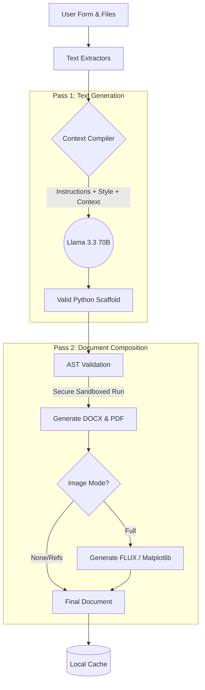

<div align="center">

# 🤖 Agent-For-TOM

**Your Personal AI Assistant for Ukrainian Academic Documents**

[](https://www.python.org/downloads/)
[](https://www.qt.io/)
[](https://huggingface.co/)
[](https://opensource.org/licenses/MIT)

A fully local, highly optimized desktop application that leverages free HuggingFace LLM models to automatically generate standardized academic documents (lab reports, guides) based on user-selected DOCX/PDF templates. 

*No logins. No cloud accounts. Zero friction.*

</div>

---

## ✨ Key Features

- 📑 **Template-Driven Generation:** Select a template (e.g. "Lab 1"), fill in a short form, and let the AI do the heavy lifting.
- 🎨 **Rich UI:** Built with PyQt6 and QML for a native, incredibly smooth user experience with multithreading and beautiful animations.
- 🖼️ **Multi-Modal AI:** 
  - **Text:** `meta-llama/Llama-3.3-70B-Instruct`
  - **Images:** `FLUX.1-schnell` for illustrations and matplotlib for technical diagrams.
- 🗃️ **Smart Caching Engine:** A custom 3-level SQLite caching system (LLM response ➔ Images ➔ Final Document). Re-runs of identical parameters are absolutely instant.
- 📄 **Context Attachments:** Easily attach your own PDFs, DOCXs, or PPTXs. The app automatically extracts the text and feeds it to the AI for highly accurate context.
- 🛠️ **Custom Template Builder:** Upload any PDF or DOCX file, annotate regions visually (Keep Format, AI-Replace, Named Gap), and save it as a brand new reusable template.

---

## 🛠 Tech Stack

| Component | Technology | Why we chose it |
|---|---|---|
| **Frontend UI** | `PyQt6` + `QML` / Qt Quick | Perfect for native Python integration, hardware acceleration, and dynamic animations. |
| **Backend** | Native `Python` | Zero web-framework overhead. Extremely fast custom orchestration. |
| **Database** | `SQLite` | Single-file, local database. Perfect for a fast, single-user desktop app. |
| **LLM (Text)** | `HuggingFace API` | We default to Llama-3.3-70B-Instruct for high-quality Ukrainian outputs. |
| **LLM (Images)** | `FLUX.1` / `matplotlib` | High-quality illustrations via API, and cost-free local diagrams via matplotlib. |
| **Doc Output** | `python-docx` + `reportlab` | Guaranteed identical, reproducible outputs in both DOCX and PDF formats. |

---

## ⚙️ Architecture & Pipeline

When you click "Generate", the app orchestrates a fully deterministic 2-pass pipeline:



---

## 🚀 Getting Started

### Prerequisites
- Python 3.10+
- A free HuggingFace API Token

### Installation

1. **Clone the repository**
   ```bash
   git clone https://github.com/iberikofer/Agent-For-TOM.git
   cd Agent-For-TOM
   ```

2. **Install dependencies**
   ```bash
   pip install -r requirements.txt
   ```

3. **Environment Setup**
   Create a `.env` file in the root directory and add your HuggingFace token:
   ```env
   HF_TOKEN=your_token_here
   ```

4. **Run the App**
   ```bash
   python main.py
   ```

---

## 📋 Standard Compliance

Our document builder is strictly designed to follow Ukrainian academic formatting standards:
- **ДСТУ 3008:2015**: Typography, margins, 1.5 line spacing, proper headings, and figure captions.
- **ДСТУ 8302:2015**: Bibliographic entry formatting.

---

<div align="center">
  <b>Developed with ❤️ by</b><br>
  <a href="https://github.com/iberikofer">Yaroslav Sych (Front-end)</a> • <a href="https://github.com/oleksandkov">Oleksandr Koval (Back-end)</a>
</div>
