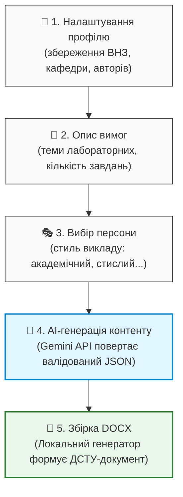

# Agent_for_TOM: Концептуальний опис та інструкція застосунку

Цей документ створено для ознайомлення колег із концепцією, архітектурою та перевагами локального веб-застосунку **Agent_for_TOM**, розробленого для автоматизації створення стандартизованих навчально-методичних документів (методичних вказівок, силабусів, робочих програм) відповідно до вимог **ДСТУ 3008:2015**.

---

## 1. Концепція проєкту

Основна ідея застосунку — **звести до мінімуму зусилля викладача** при написанні методичних матеріалів, передавши генерацію рутинного контенту штучному інтелекту (LLM), але зберігши **100% контроль над форматуванням** та безпекою локальної машини.

### Проблема:
Створення методичних вказівок вручну вимагає багато часу на:
1. Форматування за стандартами ДСТУ (поля, абзаци, шрифти, таблиці).
2. Написання теоретичного матеріалу, контрольних запитань та завдань.
3. Копіювання метаданих (назви кафедри, університету, авторів тощо) з документа в документ.

### Рішення:
Локальний веб-застосунок, який збирає профіль викладача та вимоги до лабораторних робіт через зручний інтерфейс-помічник (Wizard), делегує генерацію контенту хмарній моделі штучного інтелекту через безпечний протокол, а потім автоматично збирає готовий файл `.docx` за строгими правилами ДСТУ.

---

## 2. Як це працює (Етапи життєвого циклу)

Процес створення документа складається з 5 простих кроків:



### Крок 1: Запуск та Автозаповнення профілю
Користувач запускає застосунок однією командою (`python run.py`). Застосунок автоматично відкривається в браузері.
При першому запуску викладач заповнює профіль (ПІБ, посада, університет, кафедра, місто). Ці дані зберігаються локально в файлі `user_data/profile.json` і автоматично підставляються в усі майбутні документи.

### Крок 2: Інтерактивний Wizard (Помічник)
Користувач заповнює коротку форму:
* Обирає тип документа (наприклад, "Методичні вказівки до лабораторних робіт").
* Вказує дисципліну та теми лабораторних робіт.
* Задає мінімальні вимоги (наприклад: "Лабораторна робота 1: Тема — Побудова API на FastAPI, 4 завдання, 5 контрольних питань").

### Крок 3: Вибір стилю автора (Персони)
Викладач обирає пресет стилю викладу матеріалу:
* **Формальний академічний**: строгий стиль, пасивний стан ("розглядається", "рекомендується").
* **Практично-орієнтований**: акцент на реальних прикладах, коді та розрахунках.
* **Детальний пояснювальний**: розгорнуті пояснення для початківців.
* **Стислий технічний**: мінімум «води», тільки списки та конкретні інструкції.

### Крок 4: Безпечна AI-генерація (Gemini JSON Mode)
Застосунок бере системний промпт, додає вимоги викладача і відправляє запит до Gemini API. Завдяки технології **Structured Outputs (response_schema)** модель повертає дані строго у форматі JSON, перевіреному Pydantic-моделлю:
```json
{
  "introduction": "Вступний текст...",
  "lab_works": [
    {
      "topic": "Побудова API на FastAPI",
      "objective": "Мета роботи...",
      "theory": "Теоретичні відомості...",
      "tasks": ["Завдання 1", "Завдання 2"],
      "procedure": "Порядок виконання...",
      "questions": ["Питання 1", "Питання 2"]
    }
  ]
}
```

### Крок 5: Детермінована локальна збірка
Згенерований JSON передається локальному Python-скрипту `lab_guidelines.py`. Цей скрипт використовує бібліотеку `python-docx` і створює документ із параметрами ДСТУ 3008:2015:
* Поля: ліве 30 мм (для зшивання), праве 10 мм, верхнє/нижнє 20 мм.
* Шрифт: Times New Roman, 14 pt, полуторний інтервал, абзацний відступ 1.25 см.
* Автоматичне створення титульної сторінки, змісту та списку літератури.

---

## 3. Аналіз альтернативних варіантів реалізації

Для реалізації цієї ідеї розглядалися три різні архітектурні підходи. Нижче наведено порівняння, яке пояснює вибір обраного варіанту.

### Варіант А (Обраний): "Schema-First" (FastAPI + Gemini JSON Mode + python-docx)
AI відповідає **тільки за контент** (повертає структуровані текстові дані), а локальний Python-код відповідає **тільки за дизайн** (розкладає текст по стилях).

* **Переваги (Чому це найкраще):**
  * **Безпека**: Не виконується жодного AI-згенерованого коду. Вірус чи шкідлива команда не можуть потрапити на комп'ютер користувача.
  * **Pixel-Perfect Форматування**: Оскільки документ збирає жорстко написаний код, форматування завжди на 100% відповідає ДСТУ. Шрифт не "попливе", поля не зміняться.
  * **Швидкість**: Тільки один запит до API за контентом.
  * **Легкість**: Застосунок не потребує потужної відеокарти чи 16 ГБ оперативної пам'яті для локальної LLM.

* **Недоліки:** Потребує API-ключ Gemini (але є безкоштовні ліміти) та доступ до мережі інтернет (хоча архітектура дозволяє перемкнутися на локальну Ollama у режимі JSON).

---

### Варіант Б: "Code Generation" (Локальна LLM → Генерація коду python-docx → Виконання)
Модель штучного інтелекту отримує задачу і генерує безпосередньо Python-код для створення документа. Цей код потім виконується на машині користувача.

* **Переваги:** Повністю автономна робота без інтернету (якщо використовувати локальну LLM типу Ollama).

* **Недоліки (Чому ми відмовилися):**
  * > [!CAUTION]
    > **Критична небезпека виконання коду (RCE)**: Якщо модель піддасться атаці (Prompt Injection) або згенерує помилковий код, вона може виконати деструктивні команди на вашому ПК (наприклад, видалити файли або надіслати паролі зловмиснику).
  * **Нестабільне форматування**: LLM не може щоразу писати код з ідеальним дотриманням відступів та меж ДСТУ. Кожен документ буде виглядати по-різному.
  * **Синтаксичні помилки**: LLM часто помиляється в назвах методів бібліотеки `python-docx`, що призведе до падіння програми під час генерації.
  * **Системні вимоги**: Потребує 8-16 ГБ RAM та потужний GPU для швидкої роботи локальної моделі.

---

### Варіант В: Хмарний SaaS-сервіс (Веб-сайт в інтернеті)
Стандартний сайт, де викладачі реєструються і генерують документи на хмарному сервері.

* **Переваги:** Не потрібно нічого встановлювати на комп'ютер.

* **Недоліки:**
  * > [!WARNING]
    > **Конфіденційність та безпека даних**: Персональні дані викладачів, назви університетів та внутрішні програми дисциплін передаються на сторонні сервери.
  * **Фінансові витрати**: Необхідно платити за оренду серверів, базу даних та API-запити всіх користувачів, що вимагає введення платних підписок.
  * **Складність адміністрування**: Потребує постійної підтримки, захисту від хакерів та резервного копіювання.

---

## 4. Порівняльна таблиця архітектур

| Критерій | Варіант А (Schema-First) | Варіант Б (Code Generation) | Варіант В (Хмарний SaaS) |
| :--- | :---: | :---: | :---: |
| **Безпека системи** | 🟢 **Абсолютна** (код не виконується) | 🔴 **Низька** (загроза вірусів) | 🟡 **Середня** (ризик витоку бази) |
| **Контроль форматування** | 🟢 **100% за ДСТУ** | 🔴 **Слабкий** (залежить від AI) | 🟢 **100% за ДСТУ** |
| **Вимоги до ПК користувача**| 🟢 **Мінімальні** (будь-який ноутбук) | 🔴 **Високі** (потрібна GPU/RAM) | 🟢 **Нульові** (тільки браузер) |
| **Вартість утримання** | 🟢 **Безкоштовно** (локальний запуск) | 🟢 **Безкоштовно** (локальний запуск) | 🔴 **Висока** (хостинг, сервери) |
| **Конфіденційність** | 🟢 **Максимальна** (все на ПК) | 🟢 **Максимальна** (все на ПК) | 🔴 **Низька** (дані на чужому сервері)|

---

## 5. Переваги для викладачів та університетів

1. **Економія часу до 90%**: Замість 4-6 годин на оформлення однієї методички, викладач витрачає 10 хвилин на заповнення форми та перевірку результату.
2. **Гарантований ДСТУ 3008:2015**: Документ автоматично проходить нормоконтроль щодо розмірів шрифтів, полів та міжрядкових інтервалів.
3. **Гнучкість стилю**: Можливість адаптувати складність теорії та завдань під рівень студентів (наприклад, спрощений стиль для першокурсників, складніший — для магістрів).
4. **Повна автономність**: Застосунок працює безпосередньо на робочому комп'ютері викладача. Збережені дані (профіль, історія) нікуди не передаються.

---

## 6. Швидкий запуск для демонстрації

Щоб продемонструвати застосунок колегам на локальному комп'ютері, виконайте такі кроки:

### Крок 1: Встановлення оточення
Переконайтеся, що встановлено Python 3.11 або новішої версії. Відкрийте термінал (або PowerShell) у папці проєкту та виконайте:
```bash
pip install -r requirements.txt
```

### Крок 2: Отримання API ключа Gemini
Для генерації тексту потрібен безкоштовний API-ключ Gemini. Його можна отримати за 1 хвилину:
1. Перейдіть на [Google AI Studio](https://aistudio.google.com/).
2. Натисніть **Get API key**.
3. Скопіюйте ключ.

### Крок 3: Запуск застосунку
Виконайте команду:
```bash
python run.py
```
*Застосунок запустить локальний веб-сервер на порту 8000 і автоматично відкриє вікно вашого браузера з wizard-інтерфейсом.*
